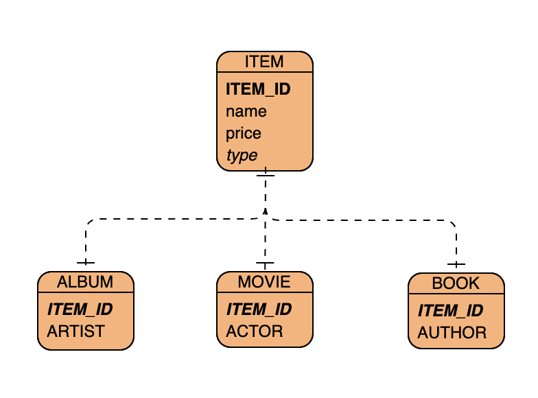
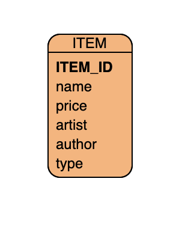

### 상속 관계 매핑


ORM 의 상속 관계 : 데이터 베이스의 슈퍼타입 서브타입 관계
슈퍼타입-서브타입의 논리적인 모델을 실제 테이블로 구현할 때는 3가지 선택을 할 수 있음

1. 각각의 테이블로 변환

```java
@Entity
// 상속 매핑에 조인 전략을 사용하겠다.
@Inheritance(strategy=InheritanceType.JOINED)
// 부모 클래스에서 자식 컬럼을 구분하는 컬럼명을 적어준다
@DiscriminatorColumn(name="type")
public abstract class Item {
    @Id @GeneratedValue
    @Column(name="ITEM_ID")
    private Long id;
    
    private String name;
  
    private int price;
}

@Entity
// 엔티티를 저장할 때 구분 컬럼에 입력할 값을 지정, type 컬럼에 A 이 저장될 것이다.
@DiscriminatorValue("A")
public class Album extends Item {
    private String artist;
}

@Entity
@DiscriminatorValue("M")
public class Movie extends Item {
    private String director;
}
```

장점
* 테이블이 정규화 됨
* 외래 키 참조 무결성 제약조건을 활용할 수 있다.
* 저장공간을 효율적으로 사용한다.

단점 
* 조회할 때 조인함 (성능 저하)
* 조회 쿼리가 복잡
* 데이터를 등록할 INSERT SQL 을 두 번 실행

2. 통합 테이블로 변환



```java
@Entity
// 상속 매핑에 단일 테이블 전략을 사용하겠다.
@Inheritance(strategy=InheritanceType.SINGLE_TABLE)
// 부모 클래스에서 자식 컬럼을 구분하는 컬럼명을 적어준다
@DiscriminatorColumn(name="type")
public abstract class Item {
    @Id @GeneratedValue
    @Column(name="ITEM_ID")
    private Long id;
    
    private String name;
  
    private int price;
}
```

장점
* 조인이 필요 없어 조회 성능이 좋음 (무조건 아님)
* 조회쿼리가 단순

단점
* 자식 엔티티가 매핑한 컬럼은 nullable 하다
* 테이블이 커질수 있어서 오히려 성능이 느려질 수 있음
3. 서브타입 테이블로 변환 
