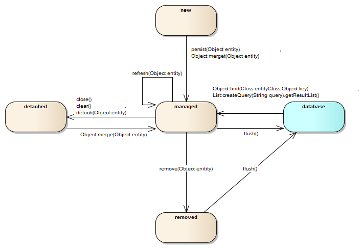

#### Entity
데이터베이스에서 영속적으로 저장된 데이터를 자바 객체로 매핑한 것, `EntityManager` 에 의해 데이터베이스의 데이터와 동기화 된다.

#### EntityManager
`Entity` 를 필요에 따라 데이터베이스와 동기화하는 역할을 담당, `영속성 컨텍스트 (Persistence Context)` 라는 `Entity` 를 관리하기 위한 영역이 있음  
`Entity` 의 상태를 변경하거나 데이터베이스와의 동기화를 위한 API 를 제공함.  

> 영속성 컨텍스트 (Persistence Context) 는 애플리케이션과 데이트베이스 사이의 캐시 같은 역할을 한다. EntityManager 에 대한 작업이 수행되더라도 즉시 데이터베이스에 반영되지 않고
> 트랙잭션이 커밋되거나 애플리케이션에서 flush API 를 호출한 타이밍에 영속성 컨텍스트에 축적된 Entity 의 변경사항이 데이터베이스에 반영된다.
> 영속성 컨텍스트는 매 트랜잭션 마다 준비되며, 다른 트랜잭션에서 처리 중인 Entity 는 참조할 수 없다.

#### Entity 의 상태
* new 상태 : 새로운 Entity 의 인스턴스가 생성되고 영속성 컨텍스트에 등록되지 않은 상태, EntityManager 는 new 상태에 있는 Entity 는 관리 대상이 아님
* 관리 상태 : 영속성 컨텍스트에 Entity 가 등록이 된 상태, EntityManager 에 의해 데이터베이스와의 동기화가 활성화 된다.
* 분리 상태 : 관리 상태였던 Entity 가 영속성 컨텍스트와 분리된 상태, new 상태와 마찬가지로 EntityManager 의 관리 대상이 아니지만 관리 상태로 되돌릴 수단은 제공
* 삭제된 상태 : 데이터베이스에서 삭제되는 것이 예정된 상태, EntityManager 가 데이터베이스의 데이터를 삭제하고 종료될 때까지 이 상태가 계속됨

> 트랜잭션이 종료되면 영속성 컨텍스트에 있는 모든 Entity 는 분리 상태로 전환된다.

   

#### JPQL (Java Persistence Query Language)
JPA 에서 기본키를 지정하지 않고도 데이터베이스의 데이터를 처리해야 할때 SQL 과 같은 유연한 쿼리를 가능하게 하는 기법

